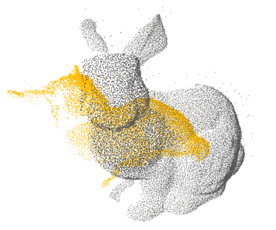

I am an assistant professor at Institute of Science Tokyo (formerly Tokyo Institute of Technology), School of Computing. I received Ph.D. in Intelligent systems engineering from the University of Tsukuba. Before joining Science Tokyo, I was a researcher at the National Institue of Advanced Industrial Science and Technology (AIST).

Email: q.chang_AT_c.titech.ac.jp

Research Interests 
======
* GPU Accelerator: kernel designs for high-performance computing that uses graphics processing units to crunch data.
* Real-time vision system: accelerating the processing of high complexity vision algorithms using special hardware such as FPGAs and GPUs.
* High-performance large-scale data processing: efficient algorithms for large-scale data processing.

Selected Research
======
 
PCL: 1x,      Open3D: 4x,       VAN-ICP: 12x 
**Proposed a GPU-accelerated method to significantly speed up nearest neighbor search for 3D point cloud registration, enhancing real-time performance in high-density spatial data processing.** 
*Accelerating Nearest Neighbor Search in 3D Point Cloud Registration on GPUs 
**Qiong Chang**, Weimin Wang, Jun Miyazaki 
_ACM Transactions on Architecture and Code Optimization, 2025_
[[bib](bibs.html#Chang_Acc)|[DOI](https://doi.org/10.1145/3716875)|[Code](https://github.com/changqiong/dilationICP)] 

 
Left (original ZNCC): 10fps,  Right (proposed Z2ZNCC): 20fps 
**Implemented fast ZNCC feature matching on embedded GPUs, offering an effective real-time alternative to traditional Census in stereo matching.** 
*Efficient Stereo Matching on Embedded GPUs with Zero-Means Cross Correlation 
**Qiong Chang**, Aolong Zha, Weimin Wang, Xin Liu, Masaki Onishi, Lei Lei, Tsutomu Maruyama 
_Journal of Systems Architecture, 2022_ [[bib](bibs.html#Chang_Efficient)|[DOI](https://doi.org/10.1016/j.sysarc.2021.102366)|[Code](https://github.com/changqiong/z2zncc)]

News(2025) 
======
* **[May, 2025]** Our paper "FSAC-IA: A HIERARCHICAL CONSTRUCTED SAC-IA ALGORITHM FOR POINT CLOUD ALIGNMENT ACCELERATION" is accepted by [ICIP'25](https://2025.ieeeicip.org/)
* **[Mar, 2025]** Our paper "Faster than Fast: Accelerating Oriented FAST Feature Detection on Low-end Embedded GPUs." is accepted by [TECS'25](https://dl.acm.org/journal/tecs)
* **[Jan, 2025]** Our paper "Efficient Parallel Implementation of Non-Local Means Algorithm on GPU." is accepted by [GPGPU'25](https://mocalabucm.github.io/gpgpu2025/)
* **[Jan, 2025]** Our paper "Accelerating Nearest Neighbor Search in 3D Point Cloud Registration on GPUs." is accepted by [TACO'25](https://dl.acm.org/journal/taco)

